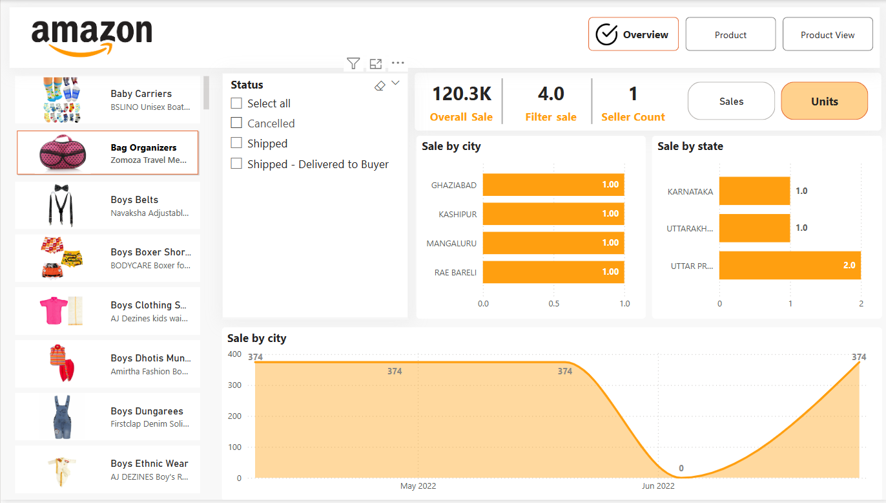
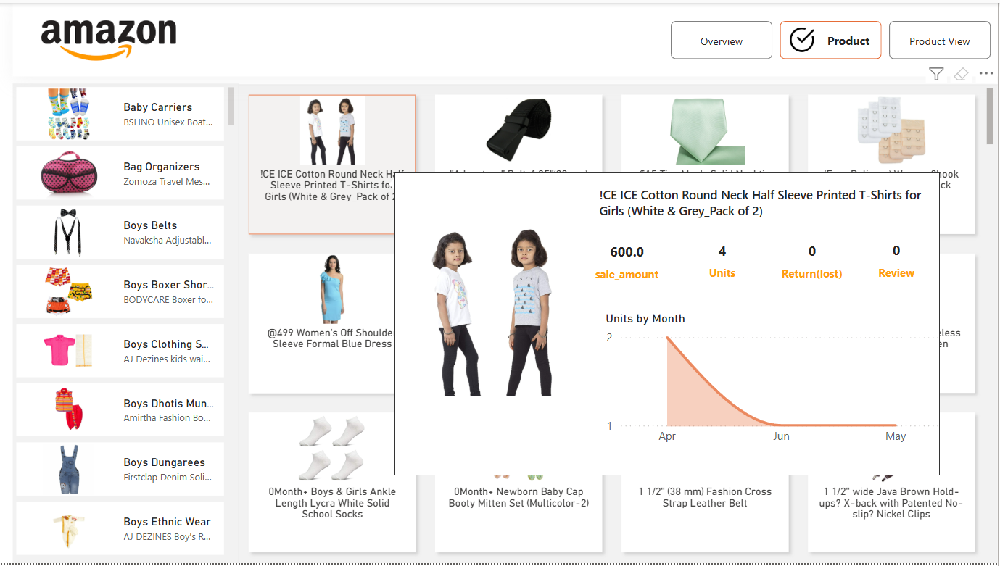
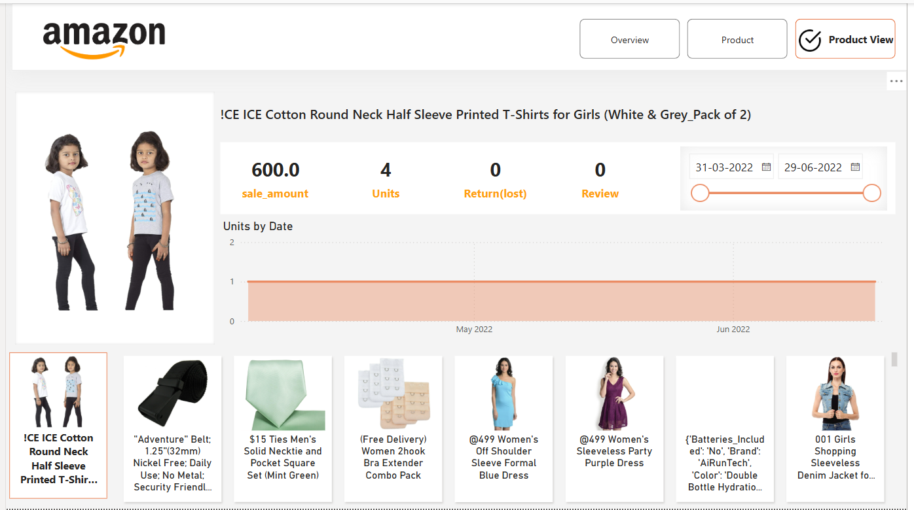

# 🛒 Amazon Sales Dashboard

This Power BI dashboard delivers a comprehensive analysis of Amazon product sales, helping stakeholders track performance, spot trends, and make data-driven decisions. It showcases advanced Power BI features including interactive filtering, dynamic KPIs, and detailed data modeling.

---

## 📊 **Key Insights**

1. **Sales Overview** – Summary of total units sold by city and state.
2. **Product Performance** – Top-performing products and their return rates.
3. **Time-Based Analysis** – Monthly trends to track performance over time.
4. **Category Comparison** – Insights on different product categories.
5. **Custom Visuals** – Interactive elements for drilldowns and filtering.

---

## 🛠️ **Technical Highlights**

✅ **Data Modeling:**  
   - Star schema with fact and dimension tables  
   - Relationship establishment between sales, products, and regions  
   - Use of filter tables for dynamic sales and unit selection

✅ **DAX Measures:**  
   - Conditional logic for sales and units based on user selection  
   - Calculation of overall sales using `CALCULATE` and `ALL` functions  
   - Dynamic seller count with filtering based on status (e.g., "Delivered")

✅ **Interactive Visuals:**  
   - Slicers and filters for interactive selection of data (e.g., sales vs. units)  
   - Drill-through functionality and dynamic KPIs

---

## 📸 **Dashboard Previews**

### 🧾 Overview Page

### 📦 Product Page

### 🔍 Product View Page

---

## 📥 **Download Report**
[Download the Power BI Report](./Report/Amazon_file.pbix)

---

## 🚀 **How to Run the Project**

1. Clone or download this repository.
2. Open the `.pbix` file in [Power BI Desktop](https://powerbi.microsoft.com/desktop).
3. The report uses two sheets for data:  
   - **Amazon Sale Report - YT**
   - **amazon-fashion - YT**
4. If prompted, re-map the data source to the local CSV files in the `Data/` folder.
5. Interact with slicers and visuals to explore insights.

---

## 📚 **Additional Notes**

- This project demonstrates skills in Power BI dashboarding, DAX, data modeling, and storytelling.
- Useful for eCommerce analytics, product sales performance, and business intelligence case studies.

---

## 📄 **License**

This project is open-source and available under the [MIT License](./LICENSE).

---
