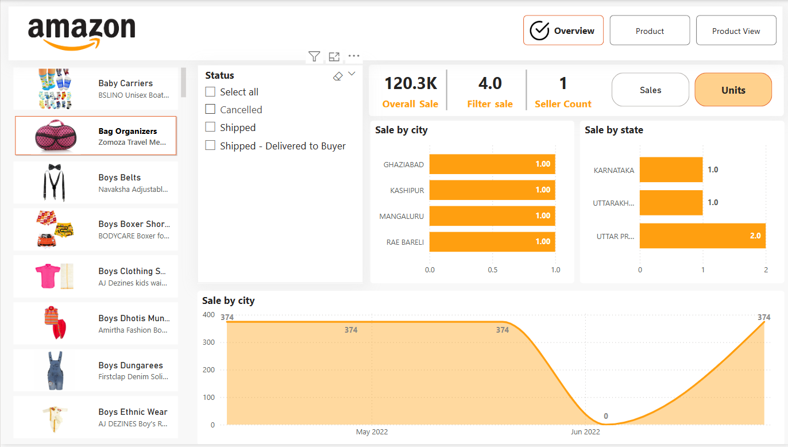
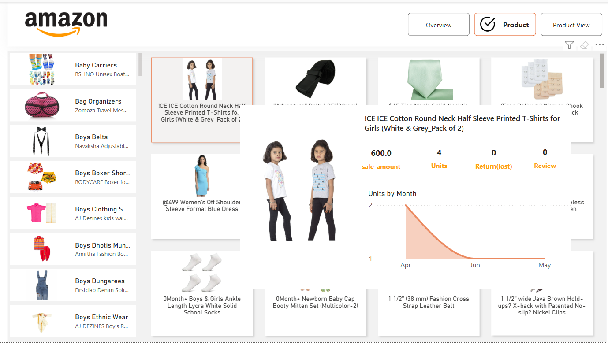
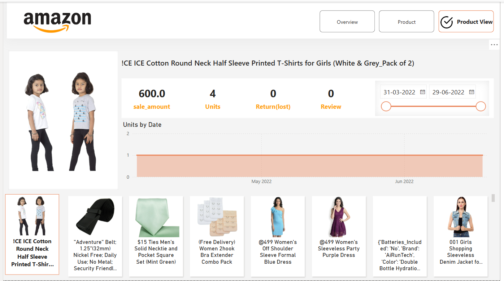

# 🛒 Amazon Sales Dashboard

An interactive Power BI dashboard delivering comprehensive analysis of Amazon product sales. This project empowers stakeholders to track performance, uncover trends, and make data-driven decisions through dynamic visuals and KPIs.

---

## 📊 **Key Insights**

1. **Sales Overview** – Total units sold by city and state.
2. **Product Performance** – Top-selling products and return analysis.
3. **Time-Based Trends** – Monthly and daily sales evolution.
4. **Category Comparison** – Performance across product categories.
5. **Geographic Analysis** – Distribution of sales by region.

---

## 🛠️ **Technical Highlights**

✅ **Data Modeling:**  
   - Star schema with fact and dimension tables.  
   - Use of filter tables for dynamic selection between sales amount and units.  

✅ **DAX Measures:**  
   - Conditional logic for switching between sales and units based on user selection.  
   - Overall sales calculation using `CALCULATE` and `ALL` functions.  
   - Dynamic seller count measure filtering by delivered status.  

✅ **Interactive Visuals:**  
   - Slicers and filters for dynamic data exploration.  
   - Drill-through functionality and KPI cards for real-time insights.  

---

## 📸 **Dashboard Previews**

### 🧾 Overview Page

### 📦 Product Page

### 🔍 Product View Page

---

## 📥 **Download Report**
[Download the Power BI Report](./Report/Amazon_file.pbix)

---

## 🚀 **How to Run the Project**

1. Clone or download this repository.  
2. Open the `.pbix` file in [Power BI Desktop](https://powerbi.microsoft.com/desktop).  
3. If prompted, re-map the data source to the `Data/amazon_sales_data.csv` file.  
4. Interact with slicers and visuals to explore insights.

---

## 📚 **Additional Notes**

- Demonstrates Power BI dashboarding, DAX, data modeling, and interactive reporting skills.  
- Ideal for eCommerce analytics, product performance analysis, and business intelligence case studies.

---

## 📄 License

This project is available under the [MIT License](./LICENSE).

